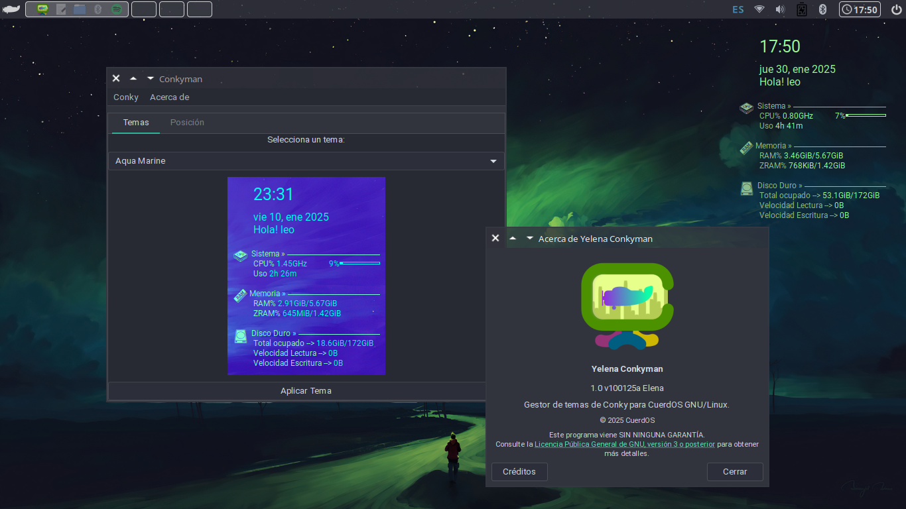

# Conkyman

<p align="center">
  
</p>

<p align="center">
  
</p>

**Conkyman** es un gestor de temas y colores para **conky**, diseñado para facilitar la personalización del sistema en **CuerdOS GNU/Linux**. Con una interfaz gráfica amigable basada en **Python 3**, **GTK** y **Qt**, permite cambiar y gestionar fácilmente configuraciones de Conky sin editar archivos manualmente.

## Características

- Interfaz intuitiva para gestionar temas de Conky.
- Soporte para **GTK** y **Qt**.
- Aplicación y previsualización instantánea de temas.
- Edición de colores y parámetros sin necesidad de abrir archivos de configuración.
- Integración con el entorno de escritorio de **CuerdOS**.

## Requisitos

- **CuerdOS GNU/Linux**
- **Python 3.x**
- **GTK 3.0** o **Qt 5+**
- **conky** instalado en el sistema

## Instalación

Clona el repositorio y ejecuta la aplicación:

```bash
git clone https://github.com/gatoverde95/Conkyman.git
cd Conkyman
python3 conkyman.py
```

## Uso

1. Ejecuta `python3 conkyman.py`.
2. Selecciona un tema de la lista o personaliza los colores.
3. Aplica los cambios y observa la vista previa en Conky.
4. Guarda la configuración y disfruta de tu nuevo tema.

## Contribuir

Si deseas colaborar en el desarrollo de **Conkyman**, síguenos en [GitHub](https://github.com/gatoverde95/Conkyman) y envía tus **Pull Requests** o reporta errores en la sección de **Issues**.

## Licencia

Este proyecto está licenciado bajo la **GPLv3**. Puedes consultar el archivo `LICENSE` para más información.

---

> **Autor:** [gatoverde95](https://github.com/gatoverde95)  
> **Repositorio:** [Conkyman](https://github.com/gatoverde95/Conkyman)
